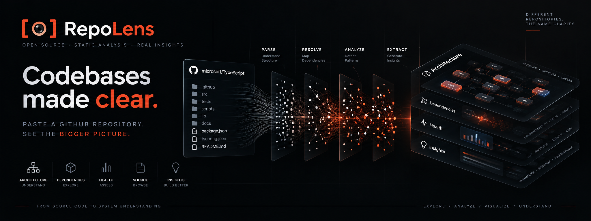

# RepoLens

<p align="center">
  
</p>

<p align="center">
  <strong>Codebases made clear.</strong><br>
  Understand the architecture, dependencies, health, and structure of an unfamiliar GitHub repository — before reading thousands of lines of code.
</p>

<p align="center">
  <a href="https://github.com/Asmit-Rai-04/RepoLens">GitHub</a>
  ·
  <a href="#getting-started">Getting Started</a>
  ·
  <a href="#architecture-of-repolens">Architecture</a>
  ·
  <a href="#api">API</a>
</p>

---

# Overview

RepoLens is an intelligent static analysis tool for understanding unfamiliar GitHub repositories.

Give RepoLens a public GitHub repository URL and it builds a structural model of the codebase:

```text
Repository
     │
     ├── Languages
     ├── Architecture
     ├── Modules
     ├── Files
     ├── Symbols
     ├── Dependencies
     ├── Cycles
     ├── Coupling
     ├── Health
     └── Insights
```

Instead of manually jumping between directories, files, imports, classes, services, repositories, and controllers, RepoLens provides a progressive exploration workflow from the system level down to the source code.

---

# Why RepoLens?

Understanding an unfamiliar repository often means manually jumping between:

- directories
- source files
- imports
- classes
- services
- repositories
- controllers
- configuration
- dependency relationships

RepoLens turns this into a progressive exploration workflow.

Instead of immediately reading thousands of lines of code, you can start by asking:

```text
What is this repository?
What languages does it use?
What architecture does it resemble?
What are its major modules?
Which files depend on each other?
Where are the dependency cycles?
Which files are highly connected?
Where are architecture violations?
Which areas deserve investigation?
```

RepoLens then lets you move from the high-level answer down to the actual source code.

---

# What Makes RepoLens Different?

There are already excellent tools for working with large codebases.

RepoLens focuses on a specific part of that problem:

> **Building an understandable structural map of a repository.**

The analysis is based on the repository itself rather than requiring an LLM to invent the underlying metrics.

```text
Repository
    │
    ├── Architecture
    ├── Modules
    ├── Files
    ├── Symbols
    ├── Dependencies
    ├── Cycles
    ├── Coupling
    ├── Health
    └── Insights
```

This makes RepoLens particularly useful for **first-pass repository reconnaissance**.

The intention is not to replace code search, AI coding assistants, or documentation platforms.

It is to provide a structural layer underneath them.

---

# RepoLens vs Other Tools

Different tools solve different parts of the code-understanding problem.

RepoLens is focused on **repository structure, architecture, dependency relationships, visual exploration, and deterministic analysis**.

| Capability | RepoLens | Repomix | Sourcegraph | Swimm |
|---|:---:|:---:|:---:|:---:|
| Repository analysis | ✓ | ✓ | ✓ | ✓ |
| AI-friendly repository packaging | — | ✓ | — | — |
| AST-based structural analysis | ✓ | ✓ | ✓ | ✓ |
| Dependency analysis | ✓ | — | ✓ | ✓ |
| Dependency cycle detection | ✓ | — | — | ✓ |
| Architecture detection | ✓ | — | — | ✓ |
| Architecture evidence | ✓ | — | — | ✓ |
| Interactive architecture visualization | ✓ | — | — | ✓ |
| File exploration | ✓ | — | ✓ | ✓ |
| Symbol exploration | ✓ | — | ✓ | ✓ |
| Source inspection | ✓ | ✓ | ✓ | ✓ |
| Repository health analysis | ✓ | — | ✓* | — |
| Structural hotspots | ✓ | — | ✓* | ✓* |
| Deterministic structural metrics | ✓ | — | ✓* | ✓* |
| Static-only analysis | ✓ | ✓ | — | — |
| Architecture → Module → File → Symbol exploration | ✓ | — | — | — |

> **Note:** This comparison describes the primary focus and capabilities of each product. It is not intended to claim that one tool completely replaces another. Product capabilities can change over time.

## RepoLens vs Repomix

[Repomix](https://github.com/yamadashy/repomix) is primarily focused on **packaging repositories into AI-friendly representations** so source code can be supplied as context to LLM workflows.

A typical workflow is:

```text
Repository
     ↓
Repository Packaging
     ↓
AI-friendly Context
     ↓
LLM
```

RepoLens takes a different approach:

```text
Repository
     ↓
Parse
     ↓
Resolve
     ↓
Analyze
     ↓
Architecture
     ↓
Dependencies
     ↓
Cycles
     ↓
Health
     ↓
Insights
     ↓
Explore
```

Repomix is useful when the goal is:

- preparing a repository for an AI assistant
- creating a compact representation of source code
- providing repository context to an LLM

RepoLens is useful when the goal is:

- understanding repository architecture
- discovering dependency relationships
- finding dependency cycles
- identifying coupling hotspots
- exploring modules and symbols
- investigating architectural violations
- building a structural map before reading the source

**These tools can complement each other rather than directly compete.**

---

## RepoLens vs Sourcegraph

[Sourcegraph](https://sourcegraph.com/) provides broad **code intelligence**, including search, navigation, code understanding, and developer workflows.

RepoLens deliberately starts from a narrower question:

> **"What is the structural shape of this repository?"**

Instead of beginning with search, RepoLens provides:

```text
Repository
     ↓
Structural Model
     ↓
Architecture
     ↓
Modules
     ↓
Dependencies
     ↓
Cycles / Coupling
     ↓
Health
     ↓
Insights
     ↓
Source
```

RepoLens emphasizes:

- architecture
- dependency relationships
- dependency cycles
- coupling
- modules
- structural hotspots
- architecture violations
- repository health

Sourcegraph is particularly strong when developers need to **search and navigate code across large codebases**.

RepoLens is designed to provide the **structural map that can come before that exploration**.

---

## RepoLens vs Swimm

[Swimm](https://swimm.io/) focuses on **application understanding, contextual documentation, and connecting engineering knowledge with code**.

RepoLens takes a more analysis-first approach.

It explicitly models:

```text
Architecture
      ↓
Modules
      ↓
Files
      ↓
Symbols
      ↓
Imports
      ↓
Inheritance
      ↓
Dependencies
      ↓
Cycles
      ↓
Coupling
      ↓
Health
```

This makes RepoLens particularly useful for **initial structural reconnaissance** of an unfamiliar repository.

Swimm and RepoLens therefore address related but different parts of the code-understanding workflow:

```text
Swimm
Application Understanding
        +
Contextual Documentation
```

```text
RepoLens
Structural Analysis
        +
Architecture
        +
Dependency Exploration
        +
Repository Health
```

---

# Where RepoLens Fits

RepoLens is best thought of as a **structural intelligence layer**.

```text
                    CODEBASE
                       │
                       ▼
              ┌─────────────────┐
              │     RepoLens    │
              └────────┬────────┘
                       │
        ┌──────────────┼──────────────┐
        ▼              ▼              ▼
   Architecture   Dependencies     Health
        │              │              │
        ▼              ▼              ▼
     Modules         Cycles        Insights
        │              │              │
        └──────────────┼──────────────┘
                       ▼
                  Source Code
```

The goal is simple:

> **Understand the map first. Then explore the territory.**

RepoLens does not attempt to replace:

- code search
- AI coding assistants
- repository packaging tools
- documentation platforms

Instead, it provides a **deterministic structural foundation** that can make those workflows easier to navigate.

---

# Key Features

| Capability | Description |
|---|---|
| **Secure Ingestion** | Bounded GitHub archive downloading and safe extraction |
| **Source Discovery** | Identifies analyzable source files while excluding generated/vendor content |
| **Multi-language Parsing** | Python, JavaScript, TypeScript, TSX, and Java |
| **AST Analysis** | Extracts classes, functions, methods, interfaces, imports, inheritance, and source ranges |
| **Dependency Graph** | Builds a directed repository dependency graph using NetworkX |
| **Import Resolution** | Resolves internal, external, and unresolved dependencies |
| **Cycle Detection** | Finds dependency cycles and strongly connected components |
| **Architecture Detection** | Detects Layered, MVC, Service/Repository, Frontend/Backend, Monorepo, and Flat structures |
| **Architecture Evidence** | Reports confidence, evidence, alternatives, and violations |
| **Repository Explorer** | Drill down from architecture → modules → files → symbols |
| **Source Inspector** | View source code with line numbers and symbol context |
| **Dependency Visualization** | Interactive graph exploration with filtering and search |
| **Health Analysis** | Deterministic health score based on repository dimensions |
| **Engineering Insights** | Ranked findings derived from repository structure |
| **Large Repository Support** | Resource-aware analysis with graceful partial-analysis behavior |
| **Security Controls** | Repository code is never executed |

---

# Supported Languages

RepoLens currently provides Tree-sitter-based structural parsing for:

- Python
- JavaScript
- TypeScript
- TSX
- Java

The parser extracts structural information including:

- files
- classes
- functions
- methods
- constructors
- interfaces
- imports
- inheritance
- source line ranges

Files that are discovered but not supported by the parser can still participate in repository-level analysis.

Individual parsing failures are preserved rather than causing the entire repository analysis to fail.

---

# How It Works

## 01 — Secure Ingestion

RepoLens accepts a public GitHub repository URL and downloads the repository archive using bounded streaming.

The archive is extracted into a controlled workspace.

Security protections include:

- GitHub URL validation
- streaming downloads
- download size limits
- extraction size limits
- extraction timeouts
- path traversal protection
- absolute-path protection
- symlink rejection
- hardlink rejection
- special-file rejection
- archive entry-count limits
- compression-ratio protection
- per-file extraction limits

Repository code is never imported, compiled, or executed.

---

## 02 — Source Discovery

After extraction, RepoLens discovers source files while avoiding content that is generally unsuitable for structural analysis.

Examples include:

```text
.git/
node_modules/
build/
dist/
generated/
vendor/
media/
binaries/
```

Discovery also records enough information to explain what was analyzed and what was skipped.

For very large repositories, RepoLens can operate within configurable resource budgets and report when an analysis is partial.

---

## 03 — AST Parsing

Supported source files are parsed using Tree-sitter.

For example, a Python file can contribute:

```text
File
 ├── Class
 │    ├── Method
 │    └── Method
 ├── Function
 └── Imports
```

A TypeScript or TSX file can contribute:

```text
File
 ├── Interface
 ├── Class
 ├── Function
 ├── Component
 └── Imports
```

Source locations are preserved so the frontend can connect structural information back to the original source.

---

## 04 — Dependency Resolution

RepoLens resolves relationships between source files.

Supported dependency evidence includes:

```text
IMPORTS
EXTENDS
IMPLEMENTS
```

Dependencies are categorized as:

### Internal

The imported target exists inside the analyzed repository.

### External

The dependency refers to a package or module outside the repository.

### Unresolved

A dependency was detected but could not be confidently mapped to a repository file.

This distinction helps prevent uncertain relationships from being presented as facts.

---

# Dependency Graph

RepoLens builds a directed dependency graph using NetworkX.

The graph can be used to calculate:

- incoming dependencies
- outgoing dependencies
- degree
- betweenness centrality
- importance
- strongly connected components
- dependency cycles
- coupling hotspots

The visualization supports:

```text
ALL
CYCLES
UNRESOLVED
EXTERNAL
IMPORTANT
```

You can also search for files and focus the graph around important nodes or detected cycles.

Large graphs are intentionally limited in the visual interface so that the result remains usable rather than becoming an unreadable wall of nodes.

---

# Architecture Detection

RepoLens uses deterministic structural evidence to identify common architectural patterns.

Supported architecture types include:

## Layered

```text
Controller
    ↓
Service
    ↓
Repository
    ↓
Model
```

## MVC

```text
Controller
    ↓
Model
    ↓
View
```

## Service / Repository

```text
API
 ↓
Service
 ↓
Repository
 ↓
Data
```

## Frontend / Backend

```text
Frontend
   │
   ▼
Backend
   │
   ▼
Data
```

## Monorepo

Multiple applications or packages are detected within a single repository structure.

## Simple / Flat

Used when the repository does not show enough structural evidence for a more specific architecture.

## Unknown

Used when there is insufficient evidence to make a reliable architectural classification.

---

# Architecture Evidence

RepoLens does not simply display an architecture label.

The result can include:

- detected architecture
- confidence
- supporting evidence
- alternative architectures
- layer classifications
- expected dependencies
- observed dependencies
- architecture violations

Examples of architectural violations include:

- skipped layers
- backward dependencies
- unexpected layer-to-layer relationships

This makes the architecture analysis explainable rather than a black-box prediction.

---

# Repository Explorer

RepoLens provides progressive repository exploration:

```text
Architecture
     │
     ▼
  Modules
     │
     ▼
   Files
     │
     ▼
  Symbols
     │
     ▼
 Source Code
```

From a repository-level view, you can drill down into:

- modules
- individual files
- classes
- functions
- methods
- interfaces
- imports
- inheritance relationships
- source line ranges

Imports can be followed into their resolved repository targets when available.

---

# Source Inspector

The source inspector connects analysis results back to the actual repository source.

It provides:

- source code
- line numbers
- symbol information
- import information
- inheritance information
- source ranges
- symbol highlighting
- copy functionality

This allows the developer to move from:

> "This file is important."

to:

> "Why is this file important?"

and finally:

> "Show me the code."

---

# Repository Health

RepoLens calculates a deterministic health score from multiple analysis dimensions.

Current weighting:

| Dimension | Weight |
|---|---:|
| Parse Health | 20% |
| Import Health | 20% |
| Cycle Health | 20% |
| Architecture Health | 25% |
| Coupling Health | 15% |

The overall health score is accompanied by the underlying dimensions so the result is explainable.

The system does not use random values or fabricate repository metrics.

---

# Engineering Insights

RepoLens generates ranked findings from the actual analysis results.

Insights can highlight:

- dependency cycles
- highly coupled files
- unresolved imports
- architecture violations
- parsing problems
- important structural hotspots
- repository areas that deserve investigation

The insight engine is deterministic.

There is no requirement for an LLM to invent or guess repository metrics.

---

# Large Repository Support

RepoLens is designed to handle repositories substantially larger than typical demo projects.

The analysis pipeline uses resource-aware limits to protect against pathological repositories and archive-based resource exhaustion.

Repositories can result in:

## Complete Analysis

All analyzable source content was successfully processed.

## Partial Analysis

Some safe content was skipped because the configured analysis budget was reached.

The system reports partial-analysis status rather than pretending that the result represents the entire repository.

## Rejected Analysis

The repository exceeded a security or resource boundary.

Examples include:

- excessive archive size
- excessive archive entry count
- dangerous compression ratios
- unsafe archive members
- extraction resource limits

---

# Large Repository Validation

RepoLens has been exercised against substantially larger real-world repositories during development.

| Repository | Source Files Analyzed | Result |
|---|---:|---|
| `gods-eye-view` | 555 | Complete |
| Kubernetes | 13,764 | Complete |
| Microsoft TypeScript | 31,329 | Complete |

Large repositories can require significant processing time, but the analysis pipeline is designed to handle them deliberately through resource budgets, optimized graph processing, and partial-analysis support.

---

# Security Model

Security is a core design principle of RepoLens.

## Repository Code Is Never Executed

RepoLens performs static analysis only.

It does not:

- run repository applications
- execute package scripts
- install repository dependencies
- import arbitrary repository modules
- compile repository applications for execution

The repository is treated as untrusted input.

## Archive Protections

The ingestion pipeline protects against:

- path traversal
- absolute paths
- symlink attacks
- hardlink attacks
- special files
- decompression bombs
- excessive archive members
- excessive extracted data
- oversized individual files

## API Protections

Source endpoints operate against the discovered-file allowlist instead of accepting arbitrary filesystem paths.

API errors are sanitized so internal implementation details are not exposed to clients.

---

# Analysis Philosophy

RepoLens follows a simple principle:

> **Evidence first. Interpretation second.**

The platform separates observable repository facts from higher-level conclusions.

For example:

```text
Observed
    ↓
Imports
    ↓
Dependency Graph
    ↓
Layer Relationships
    ↓
Architecture Evidence
    ↓
Architecture Classification
```

This makes the result easier to inspect and reason about.

---

# Deterministic by Design

Core repository analysis does not depend on an LLM response.

Structural results are derived from the repository itself.

This includes:

- dependency relationships
- cycles
- strongly connected components
- graph metrics
- architecture evidence
- architecture violations
- health dimensions
- engineering findings

The same repository structure should therefore produce reproducible structural results.

LLMs can be useful for explaining code, but RepoLens keeps the underlying structural model grounded in deterministic analysis.

---

# The RepoLens Workflow

RepoLens is designed around five stages.

## 01 — See

Get an immediate overview of the repository.

## 02 — Understand

Identify its architecture, modules, and major dependencies.

## 03 — Investigate

Find cycles, coupling hotspots, unresolved dependencies, and architecture violations.

## 04 — Drill Down

Move from:

```text
Architecture
     ↓
Module
     ↓
File
     ↓
Symbol
```

## 05 — Inspect

Open the relevant source code and understand the implementation.

```text
       SEE
        │
        ▼
    UNDERSTAND
        │
        ▼
   INVESTIGATE
        │
        ▼
    DRILL DOWN
        │
        ▼
     INSPECT
```

---

# Built for the First 30 Minutes of Understanding a Codebase

RepoLens is especially useful when entering an unfamiliar repository.

Typical questions include:

```text
Where does the application start?
What are the major modules?
Is this repository layered?
Where are the services?
Where are the repositories?
Which files have the most dependencies?
Are there dependency cycles?
Which modules are tightly coupled?
Are there unresolved imports?
Does the dependency direction match the apparent architecture?
Which files should I investigate first?
```

RepoLens turns these questions into a combination of:

- architecture views
- dependency graphs
- repository exploration
- health signals
- deterministic insights
- source-level inspection

---

# From Codebase to System Model

A repository is more than a collection of files.

RepoLens exposes relationships between those files:

```text
                    ┌───────────────┐
                    │   Repository  │
                    └───────┬───────┘
                            │
             ┌──────────────┼──────────────┐
             ▼              ▼              ▼
        Architecture     Modules       Languages
             │              │
             │              ▼
             │            Files
             │              │
             │              ▼
             │           Symbols
             │              │
             └───────┬──────┘
                     ▼
              Dependencies
                     │
          ┌──────────┼──────────┐
          ▼          ▼          ▼
        Cycles    Coupling   External
                              Deps
                     │
                     ▼
                   Health
                     │
                     ▼
                  Insights
```

The objective is to turn a repository from a **directory tree** into a **system model that developers can explore**.

---

# Why Static Analysis?

RepoLens deliberately uses static analysis as its foundation.

This provides:

- no repository execution
- reproducible structural results
- safe analysis of untrusted source
- explainable dependency relationships
- architecture evidence that can be traced back to repository structure
- deterministic metrics

This also provides a foundation for future AI-assisted explanations without making an AI responsible for the underlying repository model.

---

# Who Is RepoLens For?

## Developers Joining an Unfamiliar Project

Get the architectural map before reading hundreds of files.

## Open-Source Contributors

Understand a repository before choosing where to contribute.

## Technical Leads

Identify architectural patterns, dependency hotspots, and structural risks.

## Code Reviewers

Understand relationships between modules before diving into implementation details.

## Students and Researchers

Explore real-world repositories and study how software systems are structured.

## Developers Evaluating a Codebase

Perform a first-pass structural assessment before investing significant time in manual exploration.

---

# A Different Starting Point

Many code-understanding workflows begin with:

```text
Search
   or
AI Question
```

RepoLens starts with:

```text
             Repository
                  │
                  ▼
           Structural Model
                  │
       ┌──────────┼──────────┐
       ▼          ▼          ▼
 Architecture  Dependencies  Health
       │          │          │
       └──────────┼──────────┘
                  ▼
              Exploration
                  │
                  ▼
              Source Code
```

The result is a different way to approach an unfamiliar codebase:

> **Understand the map first. Then explore the territory.**

---

# Architecture of RepoLens

## Backend

The backend is built with FastAPI and is organized around ingestion, parsing, graph construction, architecture analysis, health analysis, insights, and API orchestration.

```text
FastAPI
   │
   ├── Repository Ingestion
   ├── Source Discovery
   ├── Language Detection
   ├── Tree-sitter Parsers
   │
   ├── Dependency Graph
   │      ├── Import Resolution
   │      ├── Cycles
   │      ├── SCCs
   │      └── Graph Metrics
   │
   ├── Architecture Detection
   │      ├── Layer Classification
   │      ├── Evidence
   │      └── Violations
   │
   ├── Health Analysis
   │
   └── Engineering Insights
```

## Frontend

The frontend uses Next.js App Router and provides:

```text
Landing
   │
   ▼
Analysis Progress
   │
   ▼
Overview
   │
   ├── Architecture
   ├── Dependency Graph
   ├── Modules
   │     └── Files
   │           └── Symbols
   ├── Health
   └── Insights
```

---

# Tech Stack

## Backend

- Python
- FastAPI
- Pydantic
- Tree-sitter
- NetworkX
- pytest

## Frontend

- Next.js
- React
- TypeScript
- @xyflow/react
- Dagre
- Vitest

---

# Getting Started

## Prerequisites

Make sure you have installed:

- Python
- Node.js
- npm
- Git

---

## Clone the Repository

```bash
git clone https://github.com/Asmit-Rai-04/RepoLens.git
cd RepoLens
```

---

# Backend Setup

Create a virtual environment:

```bash
python -m venv .venv
```

### Windows PowerShell

```powershell
.venv\Scripts\Activate.ps1
```

### Linux / macOS

```bash
source .venv/bin/activate
```

Install backend dependencies:

```bash
pip install -r requirements.txt
```

Start the FastAPI development server:

```bash
uvicorn app.main:app --reload
```

Backend:

```text
http://localhost:8000
```

Health endpoint:

```text
http://localhost:8000/health
```

---

# Frontend Setup

Open another terminal.

Navigate to the frontend:

```bash
cd frontend
```

Install dependencies:

```bash
npm install
```

Start the development server:

```bash
npm run dev
```

Frontend:

```text
http://localhost:3000
```

---

# Environment Configuration

Backend configuration can be provided through `.env`.

Start from:

```text
.env.example
```

Configuration includes controls for:

```text
APP_NAME
APP_ENV
LOG_LEVEL

MAX_REPOSITORY_BYTES
MAX_ARCHIVE_BYTES
MAX_EXTRACTED_BYTES
MAX_EXTRACTED_FILES
MAX_SINGLE_FILE_BYTES

DOWNLOAD_TIMEOUT_SECONDS

PARTIAL_EXTRACTED_BYTES_BUDGET
PARTIAL_EXTRACTED_FILES_BUDGET

GITHUB_API_BASE_URL
GITHUB_TOKEN

CORS_ALLOWED_ORIGINS
MAX_RETAINED_ANALYSES
```

A GitHub token is optional.

When supplied, it can be used to increase GitHub API rate limits.

---

# Frontend Environment

The frontend can use:

```text
NEXT_PUBLIC_API_URL
```

The default development API is:

```text
http://localhost:8000/api
```

For local configuration:

```bash
cp frontend/.env.example frontend/.env.local
```

Then update the API URL if necessary.

---

# API

| Method | Endpoint | Description |
|---|---|---|
| `POST` | `/api/analyze` | Start repository analysis |
| `GET` | `/api/analyze/{id}` | Get analysis status |
| `GET` | `/api/analyze/{id}/overview` | Repository overview |
| `GET` | `/api/analyze/{id}/architecture` | Architecture analysis |
| `GET` | `/api/analyze/{id}/graph` | Dependency graph |
| `GET` | `/api/analyze/{id}/files` | Discovered files |
| `GET` | `/api/analyze/{id}/files/{path}` | File details |
| `GET` | `/api/analyze/{id}/source/{path}` | Source code |
| `GET` | `/api/analyze/{id}/health` | Repository health |
| `GET` | `/api/analyze/{id}/insights` | Engineering insights |
| `GET` | `/health` | Backend health |

Analysis is asynchronous.

The frontend starts an analysis and polls its status until the analysis reaches a terminal state.

---

# Testing

## Backend

From the project root:

```bash
python -m pytest
```

The backend test suite covers areas including:

- GitHub URL validation
- secure archive extraction
- path traversal protection
- archive safety
- extraction limits
- language detection
- source parsing
- dependency resolution
- dependency graphs
- cycles
- strongly connected components
- graph metrics
- architecture detection
- architecture violations
- health scoring
- engineering insights
- API analysis lifecycle
- partial-analysis behavior
- large-repository safeguards

---

## Frontend

From the `frontend` directory:

```bash
npm test
```

Type checking:

```bash
npm run typecheck
```

Production build:

```bash
npm run build
```

---

# Design Principles

## Structure Before Speculation

Understand the observable repository structure before making higher-level conclusions.

## Evidence Before Labels

Architecture classifications should be supported by repository evidence.

## Determinism Before Generation

Core metrics should come from reproducible analysis rather than generated guesses.

## Progressive Disclosure

Start with the system-level view and progressively move toward individual implementation details.

## Security by Default

Repository source is untrusted input and is never executed.

## Explainable Results

A useful result should answer:

```text
What did RepoLens find?
        ↓
Why did it find it?
        ↓
Where is the evidence?
        ↓
Which files are involved?
        ↓
What source should I inspect?
```

---

# Current Project Status

RepoLens currently provides an end-to-end analysis workflow covering:

- secure repository ingestion
- source discovery
- multi-language parsing
- dependency graph construction
- import resolution
- cycle and SCC analysis
- architecture detection
- architecture evidence and violations
- repository drilldown
- source inspection
- interactive dependency visualization
- deterministic health scoring
- engineering insights
- large-repository resource handling
- partial-analysis reporting
- backend API orchestration
- Next.js frontend
- automated backend and frontend verification

The project is designed as a foundation for a hosted repository intelligence service.

---

# Current Limitations

- The current ingestion flow supports public GitHub repositories.
- Tree-sitter parsing currently covers Python, JavaScript, TypeScript, TSX, and Java.
- Unsupported source languages can be discovered but do not receive the same AST-level analysis.
- Architecture detection uses deterministic heuristics and cannot perfectly classify every real-world architecture.
- The current analysis store is in-memory.
- Analysis data does not persist across backend process restarts.
- Unauthenticated GitHub access is subject to GitHub rate limits.
- Very large repositories may require partial analysis depending on configured resource budgets.
- The dependency graph visualization intentionally limits the number of displayed nodes for usability.

---

# Roadmap

Potential future improvements include:

- persistent analysis storage
- background job processing
- private repository support
- GitHub App integration
- more programming languages
- richer symbol-level dependency analysis
- improved architecture detection
- repository history comparison
- architecture evolution tracking
- team-level repository insights
- hosted analysis infrastructure
- scalable distributed analysis for very large repositories
- AI-assisted explanations built on top of the deterministic repository model

---

# Contributing

Contributions, bug reports, architecture ideas, and improvements are welcome.

If you find a problem, please open an issue with:

1. what you expected
2. what happened
3. reproduction steps
4. relevant logs or screenshots
5. repository characteristics if the issue involves analysis

---

# Security

If you discover a security vulnerability, please avoid publicly exposing exploitable details before the issue can be addressed.

RepoLens treats analyzed repositories as untrusted input and is designed around static analysis without executing repository code.

---

# License

License information will be added when the project is formally licensed.

---

<p align="center">
  <strong>RepoLens</strong><br>
  Codebases made clear.
</p>

<p align="center">
  Built to make unfamiliar codebases easier to understand.
</p>
